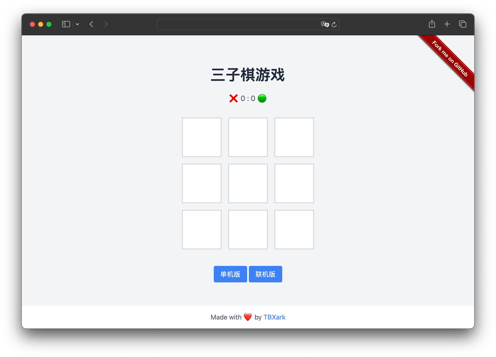

# tic-tac

1. 每人最多只能下三颗棋子，当下第四颗棋子时，最先那一颗棋子会消失。
2. 玩家可以选择单机版或联机版，联机版需要输入同一个联机码
3. 无需任何服务器和部署，下载下来打开index.html就可以联机或者单机游戏了

> 灵感来自与：https://x.com/lobotosasha/status/1779156359449072032

#### [点击试玩](https://3tictac.pages.dev)

